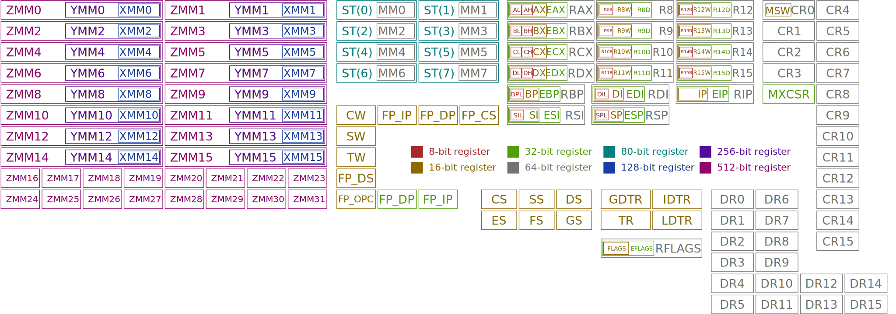
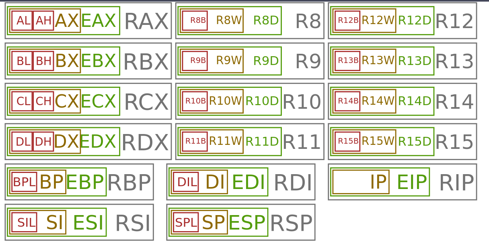
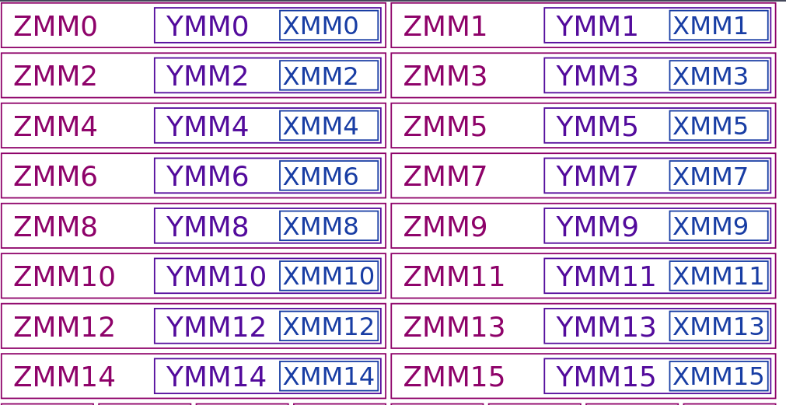

# Learning Assembly with NASM

This repository will record my learning to write x86 assembly language using NASM.

**OS**: Debian GNU/Linux bookworm 12.5 x86_64

**CPU**: AMD Ryzen 5 2600

# Table of Contents

1. [Installing NASM](#installing-nasm)
1. [Resources](#resources)
1. [Assembling Programs](#assembling-programs)
1. [NASM Program Structure](#nasm-program-structure)
1. [Sections](#sections)
1. [Instructions](#instructions)
1. [Registers](#registers)
1. [System Calls](#system-calls)
    - [File Descriptors (fd)](#file-descriptors-fd)
    - [Common syscalls](#common-syscalls)
1. [Memory Operands](#memory-operands)
1. [Using `objdump` to View Executable Instructions](#using-objdump-to-view-executable-instructions)

## Installing NASM

```bash
sudo apt install nasm
```

## Resources

[NASM Docs](https://www.nasm.us/doc/)

[AMD64 Architecture Programmer’s Manual Volumes 1-5](https://www.amd.com/content/dam/amd/en/documents/processor-tech-docs/programmer-references/40332.pdf)

[NASM Tutorial](https://cs.lmu.edu/~ray/notes/nasmtutorial/)

[ x86_64 Linux Assembly YouTube Playlist](https://youtube.com/playlist?list=PLetF-YjXm-sCH6FrTz4AQhfH6INDQvQSn&si=toV9gOHZ-j73TPxk)

[Linux System Call Table](https://www.chromium.org/chromium-os/developer-library/reference/linux-constants/syscalls/#x86_64-64-bit)

## Assembling Programs

Example program to compile


```print_hello.asm```
```asm
	section .data
msg:	db	"Enter your name: "	; 17 bytes
hello_msg: db	"Hello, "		; 7 bytes
name:	db	15			; 15 bytes

	section	.text
	global _start

_start:	; Prompt user for name
	mov rax, 1
	mov rdi, 1
	mov rsi, msg
	mov rdx, 17
	syscall

	; Get name from user
	mov rax, 0
	mov rdi, 0
	mov rsi, name
	mov rdx, 15
	syscall

	; Say hello to user
	mov rax, 1
	mov rdi, 1
	mov rsi, hello_msg
	mov rdx, 7
	syscall

	mov rax, 1
	mov rdi, 1
	mov rsi, name
	mov rdx, 15
	syscall

	; Exit program
	mov rax, 60
	mov rdi, 0
	syscall

```

### Assembling with nasm and ld

```bash
nasm -f elf64 print_hello.asm
ld print_hello.o -o print_hello
./print_hello
```

* ```-f elf64``` - format the object code file in ***elf64*** format (ELF64 (x86-64) (Linux, most Unix variants))

* ```ld``` - The GNU linker

### Assembling with nasm and gcc

* Better when using c standard library
* **Note**: To assemble ```print_hello.asm``` program above with gcc, you must replace ```_start``` label with ```main```

```bash
nasm -f elf64 print_hello.asm
gcc -no-pie print_hello.o -o print_hello
./print_hello
```

## NASM program structure

Programs are made of two types of sections:
  * Directives
  * Sections

Each line in a program can be made of the following:
  * Label
  * Instruction
  * Operands

## Sections

* All assembly programs have the following sections:
  * ```.data``` - Where all data is defined before compilation
  * ```.bss``` - Where data is allocated for future use
  * ```.text``` - Main program

## Instructions

* ```mov a, b``` - Move b to a
* ```and a, b``` - a AND b stored at a
* ```or a, b``` - a OR b stored at a
* ```xor a, b``` - a XOR b stored at a
* ```add a, b``` - Add a and b; Store at a
* ```sub a, b``` - Subtract a - b; Store at a
* ```inc a``` - Increment a
* ```dec a``` - Decrement a
* ```syscall n``` - Call OS routine n
* ```db``` - Declares bytes that will be in memory when the program runs (pseudo-instruction)

### Pseudo-Instructions for declaring initialized data

```txt
      db    0x55                ; just the byte 0x55 
      db    0x55,0x56,0x57      ; three bytes in succession 
      db    'a',0x55            ; character constants are OK 
      db    'hello',13,10,'$'   ; so are string constants 
      dw    0x1234              ; 0x34 0x12 
      dw    'a'                 ; 0x61 0x00 (it's just a number) 
      dw    'ab'                ; 0x61 0x62 (character constant) 
      dw    'abc'               ; 0x61 0x62 0x63 0x00 (string) 
      dd    0x12345678          ; 0x78 0x56 0x34 0x12 
      dd    1.234567e20         ; floating-point constant 
      dq    0x123456789abcdef0  ; eight byte constant 
      dq    1.234567e20         ; double-precision float 
      dt    1.234567e20         ; extended-precision float
```

## Registers



### 16 integer registers (64 bits wide)

Full 64 bits

```txt
R0 -- RAX
R1 -- RCX
R2 -- RDX
R3 -- RBX
R4 -- RSP   <-- Stack pointer
R5 -- RBP
R6 -- RSI
R7 -- RDI
R8
R9
R10
R11
R12
R13
R14
R15
```

Lowest 32-bits

```txt
R0D -- EAX
R1D -- ECX
R2D -- EDX
R3D -- EBX
R4D -- ESP
R5D -- EBP
R6D -- ESI
R7D -- EDI
R8D
R9D
R10D
R11D
R12D
R13D
R14D
R15D
```

Lowest 16-bits

```txt
R0W -- AX
R1W -- CX
R2W -- DX
R3W -- BX
R4W -- SP
R5W -- BP
R6W -- SI
R7W -- DI
R8W
R9W
R10W
R11W
R12W
R13W
R14W
R15W
```

Lowest 8-bits

```txt
R0B -- AL
R1B -- CL
R2B -- DL
R3B -- BL
R4B -- SPL
R5B -- BPL
R6B -- SIL
R7B -- DIL
R8B
R9B
R10B
R11B
R12B
R13B
R14B
R15B
```

bits 15 through 8 (high order bits) of R0..R3

```txt
AH
BH
CH
DH
```




### 16 XMM registers (128 bits wide)

```txt
XMM0
XMM1
XMM2
XMM3
XMM4
XMM5
XMM6
XMM7
XMM8
XMM9
XMM10
XMM11
XMM12
XMM13
XMM14
XMM15
```



## System Calls

* System calls are when program requests service from kernel.

* Each syscall has an ID

* See [Linux System Call Table](https://www.chromium.org/chromium-os/developer-library/reference/linux-constants/syscalls/#x86_64-64-bit) for list of all Linux system calls and their IDs and arguments

* Registers for system call ID and arguments:

| Argument | Register |
| -------- | --------- |
| ID | rax |
| 1 | rdi |
| 2 | rsi |
| 3 | rdx |
| 4 | r10 |
| 5 | r8 |
| 6 | r9 |


### File Descriptors (fd)

| Integer | Description |
| ------- | ----------- |
| 0 | Standard Input |
| 1 | Standard Output |
| 2 | Standard Error |

### Common syscalls

| # | syscall | rax | rdi | rsi | rdx | r10 | r8 | r9 |
| - | ------- | --- | --- | --- | --- | --- | -- | -- |
| 0 | read | 0 | unsigned int fd | char *buf | size_t count | - | - | - |
| 1 | write | 1 | unsigned int fd | const char *buf | size_t count | - | - | - |
| 60 | exit | 60 | int error_code | - | - | - | - | - |

## Argument register overview

| Argument type | Registers |
| ------------- | --------- |
| Integer/pointer arguments 1-6 | RDI, RSI, RDX, RCX, R8, R9  |
| Floating point arguments 1-8  | XMM0 - XMM7 |
| Excess arguments | Stack |
| Static chain pointer  | R10 |

## Using ```objdump``` to view executable instructions

You can use the ```objdump``` command to view the assembly instructions in an object file.

```add.c```
```c
#include <stdio.h>

int main() {
  int x, y, sum;
  x = 5;
  printf("Enter an integer for y: ");
  scanf("%d", &y);
  sum = x + y;
  printf("%d\n", sum);

  return 0;
}
```

```bash
gcc add.c
objdump -d a.out -M intel
```

* ```-d``` - disassemble
* ```-M``` - --disassembler-options=OPT Pass text OPT on to the disassembler

```txt
The following i386/x86-64 specific disassembler options are supported for use
with the -M switch (multiple options should be separated by commas):
  x86-64      Disassemble in 64bit mode
  i386        Disassemble in 32bit mode
  i8086       Disassemble in 16bit mode
  att         Display instruction in AT&T syntax
  intel       Display instruction in Intel syntax
  att-mnemonic
              Display instruction in AT&T mnemonic
  intel-mnemonic
              Display instruction in Intel mnemonic
  addr64      Assume 64bit address size
  addr32      Assume 32bit address size
  addr16      Assume 16bit address size
  data32      Assume 32bit data size
  data16      Assume 16bit data size
  suffix      Always display instruction suffix in AT&T syntax
  amd64       Display instruction in AMD64 ISA
  intel64     Display instruction in Intel64 ISA

```

Ouput of running ```objdump -d a.out -M intel```

```bash
// Rest of output

0000000000001149 <main>:
    1149:	55                   	push   rbp
    114a:	48 89 e5             	mov    rbp,rsp
    114d:	48 83 ec 10          	sub    rsp,0x10
    1151:	c7 45 fc 05 00 00 00 	mov    DWORD PTR [rbp-0x4],0x5
    1158:	48 8d 05 a5 0e 00 00 	lea    rax,[rip+0xea5]        # 2004 <_IO_stdin_used+0x4>
    115f:	48 89 c7             	mov    rdi,rax
    1162:	b8 00 00 00 00       	mov    eax,0x0
    1167:	e8 c4 fe ff ff       	call   1030 <printf@plt>
    116c:	48 8d 45 f4          	lea    rax,[rbp-0xc]
    1170:	48 89 c6             	mov    rsi,rax
    1173:	48 8d 05 a3 0e 00 00 	lea    rax,[rip+0xea3]        # 201d <_IO_stdin_used+0x1d>
    117a:	48 89 c7             	mov    rdi,rax
    117d:	b8 00 00 00 00       	mov    eax,0x0
    1182:	e8 b9 fe ff ff       	call   1040 <__isoc99_scanf@plt>
    1187:	8b 55 f4             	mov    edx,DWORD PTR [rbp-0xc]
    118a:	8b 45 fc             	mov    eax,DWORD PTR [rbp-0x4]
    118d:	01 d0                	add    eax,edx
    118f:	89 45 f8             	mov    DWORD PTR [rbp-0x8],eax
    1192:	8b 45 f8             	mov    eax,DWORD PTR [rbp-0x8]
    1195:	89 c6                	mov    esi,eax
    1197:	48 8d 05 82 0e 00 00 	lea    rax,[rip+0xe82]        # 2020 <_IO_stdin_used+0x20>
    119e:	48 89 c7             	mov    rdi,rax
    11a1:	b8 00 00 00 00       	mov    eax,0x0
    11a6:	e8 85 fe ff ff       	call   1030 <printf@plt>
    11ab:	b8 00 00 00 00       	mov    eax,0x0
    11b0:	c9                   	leave
    11b1:	c3                   	ret

// Rest of output
```